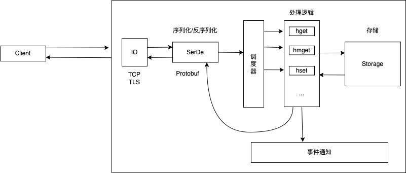

- [KV-server](#kv-server)
  - [需求](#需求)
  - [架构设计](#架构设计)
  - [主体交互接口](#主体交互接口)
    - [客户端和服务器](#客户端和服务器)
    - [CommandService](#commandservice)
    - [存储](#存储)
      - [MemTable](#memtable)
  - [错误处理](#错误处理)
  - [Server](#server)

# KV-server
## 需求
KV server 的主要需求如下：
* 核心功能是服务端能根据不同的命令进行诸如数据存贮、读取、监听等操作；
* 客户端要能通过网络访问 KV server，发送包含命令的请求，得到结果；
* 数据要能根据需要，存储在内存中或者持久化到磁盘上。

## 架构设计


1. 客户端和服务器之间采用的协议要灵活，先考虑TCP协议。网络层需要灵活，后序为保证安全可以加上TLS协议。
2. 客户端和服务器之间交互的应用层协议用protobuf定义。protobuf解决了协议的定义以及序列化和反序列化。同时protobuf解析效率高。
3. 服务器支持一些Redis命令，例如HSET、HMSET、HGET、HMGET等。从命令到命令的响应，可以做个trait进行抽象。
4. 处理流程中可以加入一些hook，具体的hook有：收到客户端的命令后 OnRequestReceived、处理完客户端的命令后 OnRequestExecuted、发送响应之前 BeforeResponseSend、发送响应之后 AfterResponseSend。这样可以方便调用者在初始化服务的时候注入额外的处理逻辑。
5. 存储方面需要灵活，可以对存储做个trait来抽象其基本行为，可以支持内存存储、也支持持久化的存储。
   
## 主体交互接口
### 客户端和服务器
使用protobuf定义，在根目录下创建[abi.proto](/kv/abi.proto)，主要定义`CommandRequest`以及`CommandResponse`。

```proto
// 来自客户端的命令请求
message CommandRequest {
  oneof request_data {
    Hget hget = 1;
    Hgetall hgetall = 2;
    Hmget hmget = 3;
    Hset hset = 4;
    Hmset hmset = 5;
    Hdel hdel = 6;
    Hmdel hmdel = 7;
    Hexist hexist = 8;
    Hmexist hmexist = 9;
  }
}

// 服务器的响应
message CommandResponse {
  // 状态码；复用 HTTP 2xx/4xx/5xx 状态码
  uint32 status = 1;
  // 如果不是 2xx，message 里包含详细的信息
  string message = 2;
  // 成功返回的 values
  repeated Value values = 3;
  // 成功返回的 kv pairs
  repeated Kvpair pairs = 4;
}
```

再在根目录下创建[build.rs](/kv/build.rs)。

```rust
fn main() {
    let mut config = prost_build::Config::new();
    config.bytes(&["."]);
    config.type_attribute(".", "#[derive(PartialOrd)]");
    config
        .out_dir("src/pb")
        .compile_protos(&["abi.proto"], &["."])
        .unwrap();
}
```
这里为了将 protobuf 文件编译成 Rust 代码，使用了第三方库[prost](https://github.com/tokio-rs/prost)。在[Cargo.toml](/kv/Cargo.toml)的配置如下：

```toml
[dependencies]
prost = "0.9" # 处理 protobuf 的代码

[build-dependencies]
prost-build = "0.9" # 编译 protobuf
```

运行`cargo build`会生成[abi.rs](kv/src/pb/abi.rs)文件。

接着在[src/pb/mod.rs](/kv/src/pb/mod.rs)中为CommandRequest实现一些方便的命令方法，以及对里面的数据实现一些转换方法，方便调用。

### CommandService
下面考虑如何处理请求的命令，返回响应。为了支持多种命令，考虑到后序的扩展，可以定义一个trait来统一处理所有的命令，返回处理结果。

创建[src/service/mod.rs](/kv/src/service/mod.rs)，在其中定义`CommandService` trait，对 Command 进行抽象。

```rust
/// 对 Command 的处理的抽象
pub trait CommandService {
    /// 处理 Command，返回 Response
    fn execute(self, store: &impl Storage) -> CommandResponse;
}
```

这样，对每个命令，具体要执行什么处理逻辑，就可以用一个函数来实现分发。

```rust
// 从 Request 中得到 Response，目前处理 HGET/HGETALL/HSET
pub fn dispatch(cmd: CommandRequest, store: &impl Storage) -> CommandResponse {
    match cmd.request_data {
        Some(RequestData::Hget(param)) => param.execute(store),
        Some(RequestData::Hgetall(param)) => param.execute(store),
        Some(RequestData::Hset(param)) => param.execute(store),
        None => KvError::InvalidCommand("Request has no data".into()).into(),
        _ => KvError::Internal("Not implemented".into()).into(),
    }
}
```

想要支持的命令可以为其实现 `CommandService` trait，以及在 dispatch 方法中加入命令的支持，这部分代码见 [src/service/command_service.rs](/kv/src/service/command_service.rs)。例如为 Hget 实现 CommandService。

```rust
impl CommandService for Hget {
    fn execute(self, store: &impl Storage) -> CommandResponse {
        match store.get(&self.table, &self.key) {
            Ok(Some(v)) => v.into(),
            Ok(None) => KvError::NotFound(self.table, self.key).into(),
            Err(e) => e.into(),
        }
    }
}
```
这里用到了 `v.into()`，可以在[src/pb/mod.rs](/kv/src/pb/mod.rs)中为响应的数据类型实现`From` trait，方便转换成 CommandResponse。例如从 `Value` 转换成 `CommandResponse`。

```rust
/// 从 Value 转换成 CommandResponse
impl From<Value> for CommandResponse {
    fn from(v: Value) -> Self {
        Self {
            status: StatusCode::OK.as_u16() as _,
            values: vec![v],
            ..Default::default()
        }
    }
}
```
### 存储
为了实现能支持不同的存储，可以设计一个 Storage trait，它提供 KV store 主要的接口。创建[src/storage/mod.rs](/kv/src/storage/mod.rs)。

```rust
/// 对存储的抽象，我们不关心数据存在哪儿，但需要定义外界如何和存储打交道
pub trait Storage {
    /// 从一个 HashTable 里获取一个 key 的 value
    fn get(&self, table: &str, key: &str) -> Result<Option<Value>, KvError>;
    /// 从一个 HashTable 里设置一个 key 的 value，返回旧的 value
    fn set(
        &self,
        table: &str,
        key: impl Into<String>,
        value: impl Into<Value>,
    ) -> Result<Option<Value>, KvError>;
    /// 查看 HashTable 中是否有 key
    fn contains(&self, table: &str, key: &str) -> Result<bool, KvError>;
    /// 从 HashTable 中删除一个 key
    fn del(&self, table: &str, key: &str) -> Result<Option<Value>, KvError>;
    /// 遍历 HashTable，返回所有 kv pair（这个接口不好）
    fn get_all(&self, table: &str) -> Result<Vec<Kvpair>, KvError>;
    /// 遍历 HashTable，返回 kv pair 的 Iterator
    fn get_iter(&self, table: &str) -> Result<Box<dyn Iterator<Item = Kvpair>>, KvError>;
}
```

这样，后期如果要添加不同的 store，只需要为其实现 Storage trait 即可，不必修改 CommandService 相关的代码。为了在多线程/异步环境下读取和更新，接口中的是 `&self` 参数。

#### MemTable
使用[dashmap](https://docs.rs/dashmap/latest/dashmap/index.html)来创建一个 MemTable 结构，`DashMap`结实现了并发。接口类似于HashMap，可看作`RwLock<HashMap<K, V, S>>`。创建文件[src/storage/memory.rs](/kv/src/storage/memory.rs)，为其实现 Storage trait。

```rust
/// 使用 DashMap 构建的 MemTable，实现了 Storage trait
#[derive(Clone, Debug, Default)]
pub struct MemTable {
    tables: DashMap<String, DashMap<String, Value>>,
}
```

## 错误处理
为了方便错误类型转换，定义一个KvError，用[thiserror](https://github.com/dtolnay/thiserror)派生宏来定义错误类型。代码见[error.rs](/kv/src/error.rs)。

## Server
在[src/service/mod.rs](/kv/src/service/mod.rs)中添加 `Service` 结构。

```rust
/// Service 数据结构
pub struct Service<Store = MemTable> {
    inner: Arc<ServiceInner<Store>>,
}

impl<Store> Clone for Service<Store> {
    fn clone(&self) -> Self {
        Self {
            inner: Arc::clone(&self.inner),
        }
    }
}

/// Service 内部数据结构
pub struct ServiceInner<Store> {
    store: Store,
}

impl<Store: Storage> Service<Store> {
    pub fn new(store: Store) -> Self {
        Self {
            inner: Arc::new(ServiceInner { store }),
        }
    }

    pub fn execute(&self, cmd: CommandRequest) -> CommandResponse {
        debug!("Got request: {:?}", cmd);
        // TODO: 发送 on_received 事件
        let res = dispatch(cmd, &self.inner.store);
        debug!("Executed response: {:?}", res);
        // TODO: 发送 on_executed 事件

        res
    }
}

// 从 Request 中得到 Response，目前处理 HGET/HGETALL/HSET
pub fn dispatch(cmd: CommandRequest, store: &impl Storage) -> CommandResponse {
    match cmd.request_data {
        Some(RequestData::Hget(param)) => param.execute(store),
        Some(RequestData::Hgetall(param)) => param.execute(store),
        Some(RequestData::Hset(param)) => param.execute(store),
        None => KvError::InvalidCommand("Request has no data".into()).into(),
        _ => KvError::Internal("Not implemented".into()).into(),
    }
}
```

1. Service 结构内部是 ServiceInner 存放实际的数据结构，Service 对其用 Arc 包裹，这样的话就可以在多线程下把 clone 的主体和其内部结构分开，代码逻辑更加清晰。
2. execute() 方法后面还可以实现一些事件的分发。